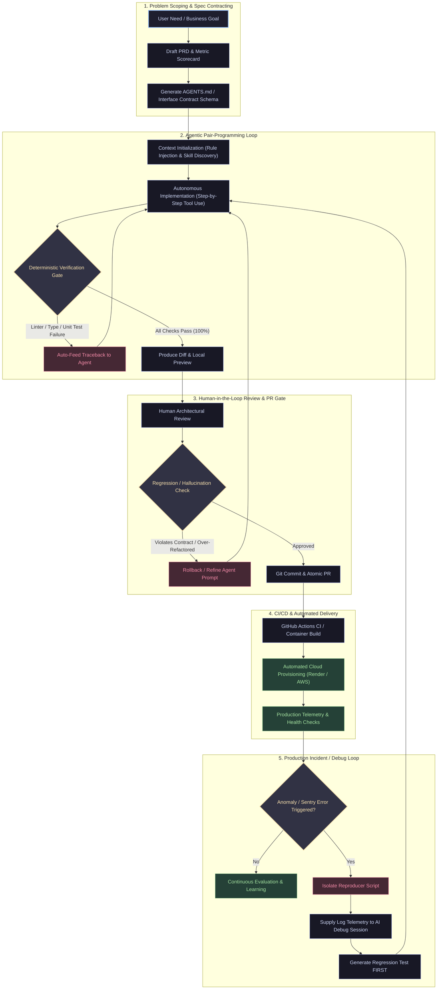

# Saurav Dodiya — AI Coding Workflow & Lifecycle Architecture

This document details my end-to-end AI-augmented product and engineering lifecycle: from problem specification to production delivery, automated review gates, and incident root-cause diagnosis.

---

## 1. End-to-End Workflow Architecture (Mermaid Diagram)

---

## 2. Core Pillars of My Workflow

### A. Spec Contracting Before Token Generation
Before opening an AI coding session, I define clear contracts:
- Input/output schemas (JSON schema / Pydantic models).
- Acceptance criteria and edge cases.
- System constraints embedded in `AGENTS.md` (e.g. strict lint rules, directory boundaries).

### B. The 3-Strike Rule & Deterministic Verification
I never trust generated code until deterministic tools pass:
1. **Static Analysis & Types**: Linters (`ruff`, `eslint`, `tsc`) run automatically on save.
2. **Unit & Integration Tests**: PyTest/Jest suites with real assert assertions.
3. **Execution Sandbox**: The agent is given access to run terminal commands to verify its own code before requesting human review.
If the agent loops 3 times on the same bug, I intervene, isolate the minimal reproducible snippet in a scratch script, and provide explicit steering.

### C. Incident Debugging: "Test-First" Root Cause Analysis
When production telemetry or user issues arise:
1. **Capture minimal payload**: Extract exact headers/payload from logs.
2. **Write a failing test first**: Create `test_repro_<issue>.py` reproducing the exact failure state.
3. **Feed failure trace to AI agent**: Instruct the agent: *"Modify only the core logic to make this test pass without altering existing test baselines."*
4. **Deploy hotfix with regression lock**: Prevents the same bug from re-emerging.
